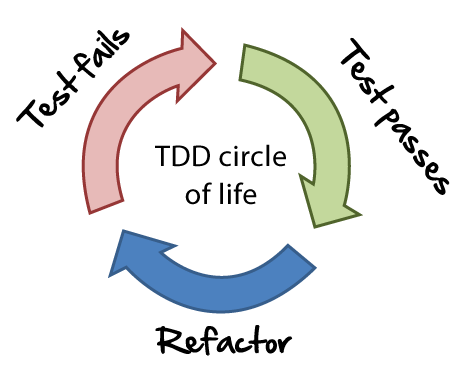

# TDD

- Desenvolver orientado a testes é diferente desenvolver com testes;
- A prática de TDD possui os seguintes passos:
    1. Criar o teste antes de ter o que testar e ver ele falhando miseravelmente (etapa RED/fail) - auxilia na orientação/simplificação do código
    1. Fazer o teste passar da maneira mais simples possível (etapa GREEN/pass) - usada para confirmar a efetividade do teste/analise do retorno
    1. Implementar o código real que deve ser testado (etapa BLUE/refactor)

## RED
1. Criar o método de teste
1. Escrever asserts do teste
1. Rodar o teste e confirmar a falha
> O teste deve falhar por nem conhecer a classe/método

## GREEN
1. Criar classe se necessário
1. Criar o método da classe que está sendo testado
1. Retornar literalmente o esperado pelo teste
1. Rodar o teste e confirmar o sucesso
> O teste deve passar por reconhecer o retorno - que foi implementado ao pé da letra do que era esperado pelo teste.

## BLUE
1. Refatorar a o método testado para funcionar como deve ser implementado
1. Rodar o teste e confirmar o sucesso

## Dicas
- O nome da classe de teste, por convenção deve ser `ClasseTestada` + `Teste` + `.php`
- O nome da função de teste, por convenção deve ser `test` + `CenarioDoTeste`
- O ideal é um assert por test

## Testes de integração x unitários
- Unitário: testa as funçoes atomicas da classe;
- Integração: testa as funções que exigem relacionamento (integração) de classes;
- Comportamentais: ?

